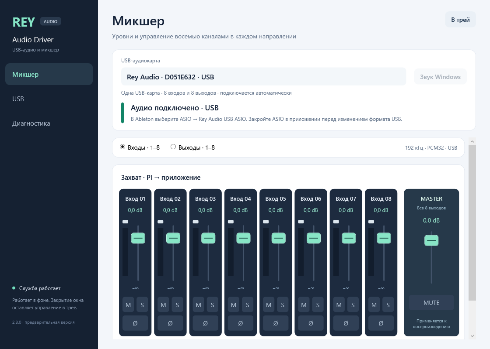
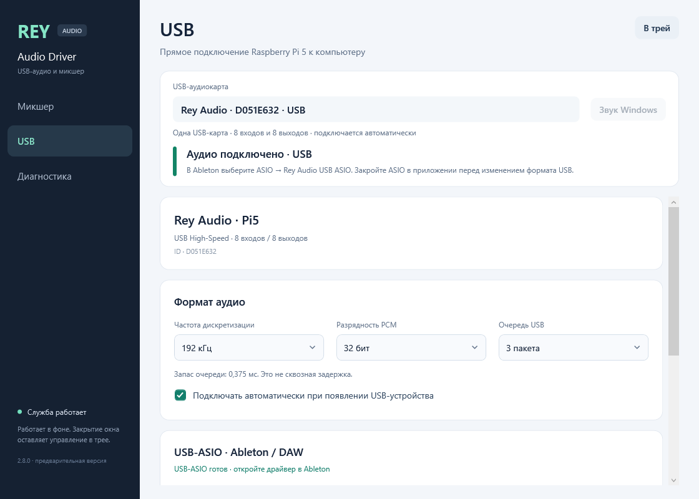
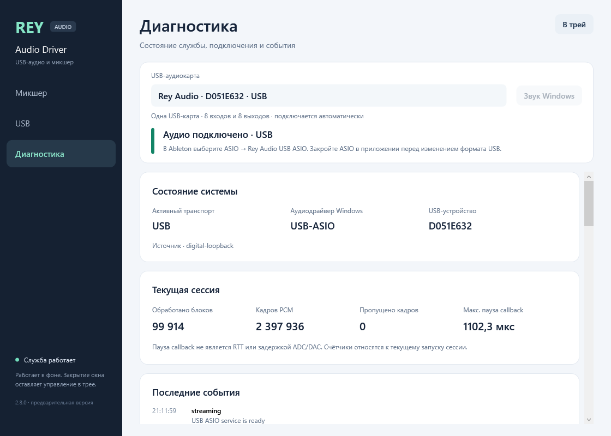

# Rey Audio Driver

**English** · [Русский](README.ru.md)

**USB audio, ASIO and a live mixer for one Raspberry Pi 5 on Windows x64.**
Eight inputs and eight outputs, integer PCM16/24/32 and six sample rates from
44.1 to 192 kHz. The service connects the board automatically and keeps running
when the mixer window closes.

**[Download 2.8.0 USB preview](https://github.com/danrey-bilo/Rey-Audio-Driver-win/releases/tag/v2.8.0-usb-preview.1)**
· [Install & Ableton](docs/USB-ASIO.md)
· [Documentation](docs/README.md)
· [Pi5-AUSB transport](https://github.com/danrey-bilo/Pi5-AUSB)

> **Pre-release.** The USB-only conversion, local upgrade and PCM-format checks
> passed. Nominal frame cadence, consistently sub-2-ms RTT and physical ADC/DAC
> latency remain unqualified. See the [exact-build report](docs/USB-ONLY-2.8.md).

## Mixer

Control eight input or eight output channels with gain, Mute, Solo and polarity.
Output Master controls playback. Meters show real PCM levels. The panel has
three pages: **Mixer**, **USB** and **Diagnostics**, with access from the tray.

<strong>USB settings and diagnostics</strong>

## Start in Ableton

1. Download **Rey-Audio-USB-ASIO-2.8.0-preview.1-x64.exe** from the release and
   run it. Accept UAC; the installer adds the ASIO driver, automatic service
   and mixer/tray panel.
2. Connect one configured Pi5-AUSB board over USB. Open **Rey Audio Driver**.
3. In Ableton **Settings → Audio**, set **Driver Type: ASIO** and
   **Audio Device: Rey Audio USB ASIO**. Enable the required inputs/outputs.
4. For the documented 192 kHz test, start with **64 Samples**. Set USB queue
   and ASIO render reserve manually using the [buffer guide](docs/BUFFER-GUIDE.md).

Microsoft WinUSB handles the USB interface. The package needs no installation
INI, custom kernel driver, test certificate, Test Mode or boot/security change.
Fully close the DAW before an update because it can keep the ASIO DLL loaded.
The [installation guide](docs/USB-ASIO.md) describes format changes and reopening.

## Capabilities

| Feature | USB preview |
|---|---|
| Device | One Rey Audio USB board; automatic detection and stable identity |
| Channels | 8 capture + 8 playback |
| Formats | PCM16, packed PCM24, integer PCM32 |
| Sample rates | 44.1 / 48 / 88.2 / 96 / 176.4 / 192 kHz |
| Transport | Pi5-AUSB, USB High-Speed interrupt transfers, asynchronous WinUSB |
| Processing | Bounded PCM rings, gain ramps, Mute/Solo/polarity, live meters |
| Buffers | Manual ASIO block/render lead and USB queue; no automatic tuning |
| Startup | Windows service at boot; panel/tray at login |
| Settings | Atomic USB/mixer registry profile; migration of earlier USB settings |
| Chrome / Telegram | System Windows audio endpoints remain a separate qualification stage |

## Validation

| Check | Result for this build |
|---|---|
| Native contracts | **32/32 passed** |
| PCM formats, block64 / lead4 / USB depth3 | **18/18 passed**, five seconds per profile |
| 192 kHz / PCM32, block64 / lead4 / depth3 | **295 s**, zero capture drops or render late/missing frames |
| Digital RTT in that run, p50 / p95 / p99 / max | **1.6286 / 1.8837 / 2.0103 / 3.5171 ms** |
| Observed frame cadence | **2.09% below nominal**; still requires investigation |

The initial lead3 matrix had four failures; the 295 s lead3 run also dropped
frames. All failed results are retained in the [report](docs/USB-ONLY-2.8.md)
and [machine-readable evidence](docs/evidence/rey-usb-only-20261003.json).
The host for these new-build tests was the installed native ASIO probe, not
Ableton. The Pi used a digital loopback; ADC/DAC was not connected.

ASIO's **1.3802 ms** with lead3 and **1.7135 ms** with lead4 at 192 kHz/64/depth3
are the reported buffer model. They do not replace measured roundtrip.

## Build and explore

Use Windows x64, C++17, CMake, .NET Framework 4.8, a Pi5-AUSB checkout/SDK and
separately obtained Steinberg ASIO interface headers. SDK headers are not
included. [Build instructions](docs/BUILD.md).

| Guide | Contents |
|---|---|
| [Architecture](docs/ARCHITECTURE.md) | Service ownership, USB, shared PCM rings and module boundaries |
| [Control API](docs/API.md) | USB profile, mixer and status commands |
| [Mixer](docs/MIXER.md) | Channel controls, routing direction and meters |
| [Release notes](docs/RELEASE-2.8.0.md) | What changed and what is included |
| [Validation report](docs/USB-ONLY-2.8.md) | Exact binary hashes, passed/failed tests and remaining work |
| [Windows endpoints](docs/ENDPOINTS.md) | Separate system-audio backend status |

From **2.8.0**, development is USB-only and supports one board. AoIP/LAN and
multiple-card management are retired; their sources and reports are preserved
in [the archive](archive/aoip/README.md), outside the active build. Separate
AoIP repositories and old release assets are unchanged.

[License](LICENSE) · [External ASIO SDK](docs/ASIO-SDK.md)
