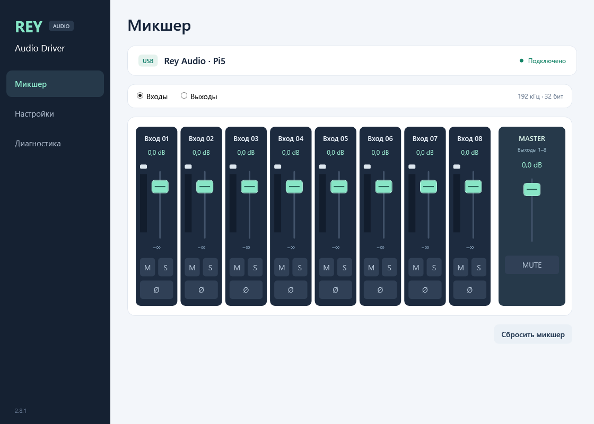
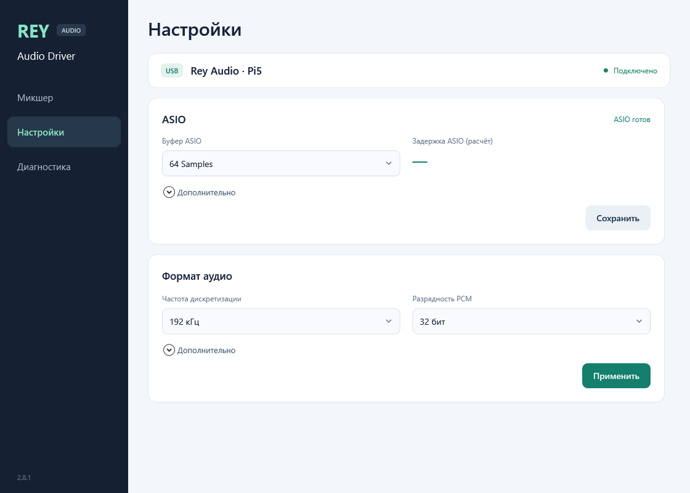
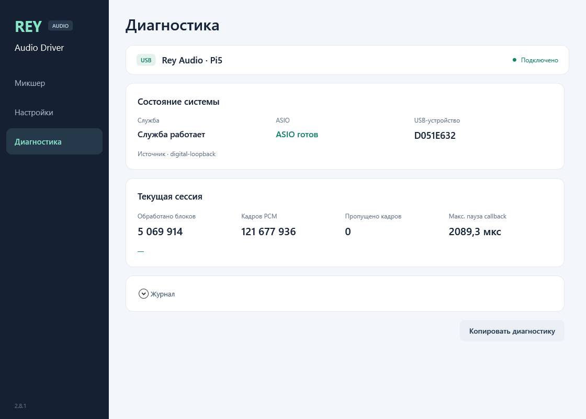

# Rey Audio Driver

**English** · [Русский](README.ru.md)

**USB audio, ASIO and a live mixer for one Raspberry Pi 5 on Windows x64.**
Eight inputs and eight outputs, integer PCM16/24/32 and six sample rates from
44.1 to 192 kHz. The service connects the board automatically and keeps running
when the mixer window closes.

**[Download 2.8.1 USB preview 2](https://github.com/danrey-bilo/Rey-Audio-Driver-win/releases/tag/v2.8.1-usb-preview.2)**
· [Install & Ableton](docs/USB-ASIO.md)
· [Documentation](docs/README.md)
· [Pi5-AUSB transport](https://github.com/danrey-bilo/Pi5-AUSB)

> **Pre-release.** Native 96/192 kHz profiles completed 175 s with zero PCM
> errors and RTT p99 about 1.53 ms. Rare maxima still exceeded 3 ms.
> Actual Ableton load checks and physical-audio limits are recorded in
> the [2.8.1 report](docs/USB-LATENCY-2.8.1.md).

## Mixer

Control eight input or eight output channels with gain, Mute, Solo and polarity.
Output Master controls playback. Meters show real PCM levels. The panel has
three pages: **Mixer**, **Settings** and **Diagnostics**, with access from the tray.

<strong>USB settings and diagnostics</strong>

## Start in Ableton

1. Download **Rey-Audio-USB-ASIO-2.8.1-preview.2-x64.exe** from the release and
   run it. Accept UAC; the installer adds the ASIO driver, automatic service
   and mixer/tray panel.
2. Connect one configured Pi5-AUSB board over USB. Open **Rey Audio Driver**.
3. In Ableton **Settings → Audio**, set **Driver Type: ASIO** and
   **Audio Device: Rey Audio USB ASIO**. Enable the required inputs/outputs.
4. For the documented 192 kHz test, start with **64 Samples**. Set USB queue
   and ASIO render reserve manually using the [buffer guide](docs/BUFFER-GUIDE.md).

Microsoft WinUSB handles the USB interface. The package needs no installation
INI, custom kernel driver, test certificate, Test Mode or boot/security change.
Fully close the DAW before an update because it can keep the ASIO DLL loaded.
The [installation guide](docs/USB-ASIO.md) describes format changes and reopening.

## Capabilities

| Feature | USB preview |
|---|---|
| Device | One Rey Audio USB board; automatic detection and stable identity |
| Channels | 8 capture + 8 playback |
| Formats | PCM16, packed PCM24, integer PCM32 |
| Sample rates | 44.1 / 48 / 88.2 / 96 / 176.4 / 192 kHz |
| Transport | Pi5-AUSB, USB High-Speed interrupt transfers, asynchronous WinUSB |
| Processing | Bounded PCM rings, gain ramps, Mute/Solo/polarity, live meters |
| Buffers | Manual ASIO block/render lead and USB queue; no automatic tuning |
| Startup | Windows service at boot; panel/tray at login |
| Settings | Atomic USB/mixer registry profile; migration of earlier USB settings |
| Chrome / Telegram | System Windows audio endpoints remain a separate qualification stage |

## Validation

| Check | Result for 2.8.1 |
|---|---|
| Windows contracts | **32/32 passed** |
| Pi5-AUSB contracts, Windows / Pi | **7/7 / 7/7 passed**; SDK 0.1.1 EXACT consumer **1/1** |
| PCM16/24/32 × 96/192 kHz | **6/6 passed**, five seconds per format, block64/lead3/depth4 |
| Final native 192 kHz / block64 / lead3 / depth4 | **175 s**, zero capture drops, render late/missing frames or overflow |
| Final native 96 kHz / block32 / lead3 / depth4 | **175 s**, same zero counters |
| Actual Ableton, 192/64 and 96/32, lead3/depth4 | **175 s each, Simulator 50%**, zero drops/late/missing/overflow |
| RTT p50 / p95 / p99 / max, 192 kHz | **1.3536 / 1.4298 / 1.5280 / 4.3675 ms** |
| RTT p50 / p95 / p99 / max, 96 kHz | **1.3665 / 1.4227 / 1.5199 / 3.1292 ms** |
| Frame cadence, 192 / 96 kHz | **−0.0706% / −0.0219%**; within the digital bench's ±1% guard |

These are native-host digital measurements. Actual Ableton observations are
separate in the [report](docs/USB-LATENCY-2.8.1.md), including failed small buffers.
Strict maximum RTT below 3 ms is still open. ASIO reports a **1.5052 / 1.5104 ms**
buffer model for those candidates; that calculation is not measured analog RTT.
ADC/DAC was not connected. [Complete evidence](docs/evidence/rey-usb-latency-281-20261003.json).

## Build and explore

Use Windows x64, C++17, CMake, .NET Framework 4.8, a Pi5-AUSB checkout/SDK and
separately obtained Steinberg ASIO interface headers. SDK headers are not
included. [Build instructions](docs/BUILD.md).

| Guide | Contents |
|---|---|
| [Architecture](docs/ARCHITECTURE.md) | Service ownership, USB, shared PCM rings and module boundaries |
| [Control API](docs/API.md) | USB profile, mixer and status commands |
| [Mixer](docs/MIXER.md) | Channel controls, routing direction and meters |
| [Release notes](docs/USB-PREVIEW2-20261004.md) | Interface, tray startup and Pi cleanup |
| [Validation report](docs/USB-LATENCY-2.8.1.md) | Exact binary hashes, passed/failed tests and remaining work |
| [Windows endpoints](docs/ENDPOINTS.md) | Separate system-audio backend status |

From **2.8.0**, development is USB-only and supports one board. AoIP/LAN and
multiple-card management are retired; their sources and reports are preserved
in [the archive](archive/aoip/README.md), outside the active build. Separate
AoIP repositories and old release assets are unchanged.

[License](LICENSE) · [External ASIO SDK](docs/ASIO-SDK.md)

**[Interface update and Pi cleanup](docs/USB-PREVIEW2-20261004.md)**
