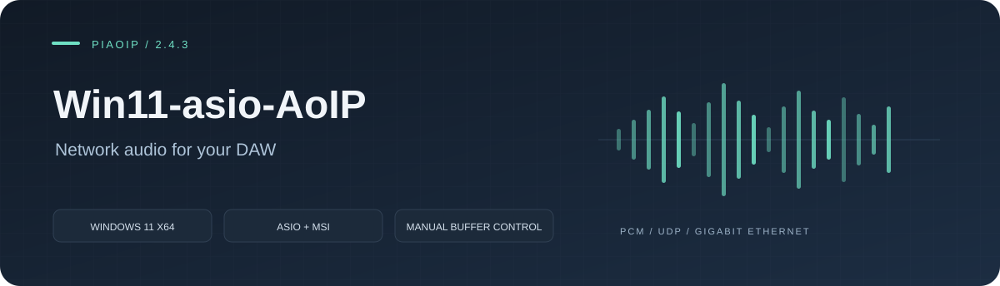
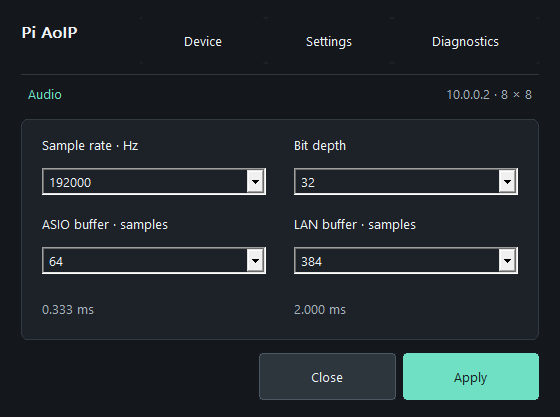

# Win11-asio-AoIP

**English** | [Русский](README.ru.md)

Windows 11 x64 audio transport over wired Ethernet: an independent network service, the existing ASIO adapter and an experimental ACX/KMDF audio driver.

The development branch also contains an [independent single-Pi service and ACX driver](docs/ACX-SERVICE.md). The service builds without ASIO; the kernel driver is unsigned and awaiting installation/WASAPI qualification.

**[Download 2.5.0](https://github.com/danrey-bilo/Win11-asio-AoIP/releases/tag/v2.5.0)** · **[Release notes](docs/RELEASE-2.5.0.md)** · **[Validation](docs/VALIDATION.md)**

[Transport and endpoint status](docs/TRANSPORT-2.5.md)

**Downloads:** ASIO MSI for the existing DAW adapter; `PiAoIP-2.5.0-Windows-service-ACX-development-x64.zip` for the independent service and unsigned driver. The ZIP requires manual setup on a prepared driver test stand. See [service setup](docs/ACX-SERVICE.md).

## Get started

1. Download [PiAoIP-2.5.0-Windows11-x64.msi](https://github.com/danrey-bilo/Win11-asio-AoIP/releases/download/v2.5.0/PiAoIP-2.5.0-Windows11-x64.msi).
2. Close your ASIO hosts and exit PiAoIP from the tray, then run the MSI.
3. Open **PiAoIP Settings → Device → Find and connect** and select the Pi.
4. Choose **Sample rate**, **Bit depth**, **ASIO buffer** and **LAN buffer**, then **Apply**.
5. Select **Pi AoIP** in your 64-bit DAW and open its audio engine.

The panel, tray and installed help are in English. **Automatic buffer tuning has been removed.** Choose buffers manually and check your actual DAW workload. Device channel counts come from the Pi; use **Device → Channels** to select existing channels.

The MSI installs the ASIO DLL, settings/tray application, installation guide and license notices. It adds ASIO registration and a local-subnet UDP 50021 firewall rule. Both Start menu shortcuts and the application now have embedded icons.
It does not install Windows microphone/speaker endpoints, a kernel audio driver or a Pi firmware image.

## At a glance

| Item | Support |
|---|---|
| System | Windows 11 x64; 64-bit ASIO host |
| Main controls | Rate, PCM bit depth, ASIO buffer, LAN buffer |
| ASIO buffer | 16–2048 samples, powers of two |
| LAN buffer | 0–2048 samples; manual |
| Sessions | One streaming ASIO client per Pi/PC pair |
| Audio profiles | Up to 64 channels per direction; 44.1–192 kHz; PCM16/24/32 |
| Transport | PiAoIP UDP/IPv4 over Ethernet; not AES67 or Dante |

## Documentation

[Installation](docs/INSTALL.md) · [Build](docs/BUILD.md) · [Host API](docs/API.md) · [Architecture](docs/ARCHITECTURE.md) · [Buffer guide](docs/BUFFER-GUIDE.md)

English is the primary documentation language. Each maintained guide links to its Russian edition. Version 2.5.0 is a **development preview**: build and package checks do not establish physical ADC/DAC support or a guaranteed latency. The supplied Pi service generates and checks synthetic PCM; a hardware audio backend is still required for a physical sound card.

## Project components

| Repository | Purpose |
|---|---|
| [AoIP-lib](https://github.com/danrey-bilo/AoIP-lib) | Protocol and portable libraries |
| [Win11-asio-AoIP](https://github.com/danrey-bilo/Win11-asio-AoIP) | Windows service, ASIO and ACX development driver |
| [Pi4-AoIP](https://github.com/danrey-bilo/Pi4-AoIP) | Raspberry Pi 4 / PREEMPT_RT service |
| [Pi5-AoIP](https://github.com/danrey-bilo/Pi5-AoIP) | Raspberry Pi 5 / PREEMPT_RT service |

## License

Personal, noncommercial use is free. Commercial use requires a separate paid written license. See [LICENSE](LICENSE) and the [Russian explanation](docs/LICENSE-RU.md). The external Steinberg ASIO SDK has separate terms; see [ASIO SDK](docs/ASIO-SDK.md).
