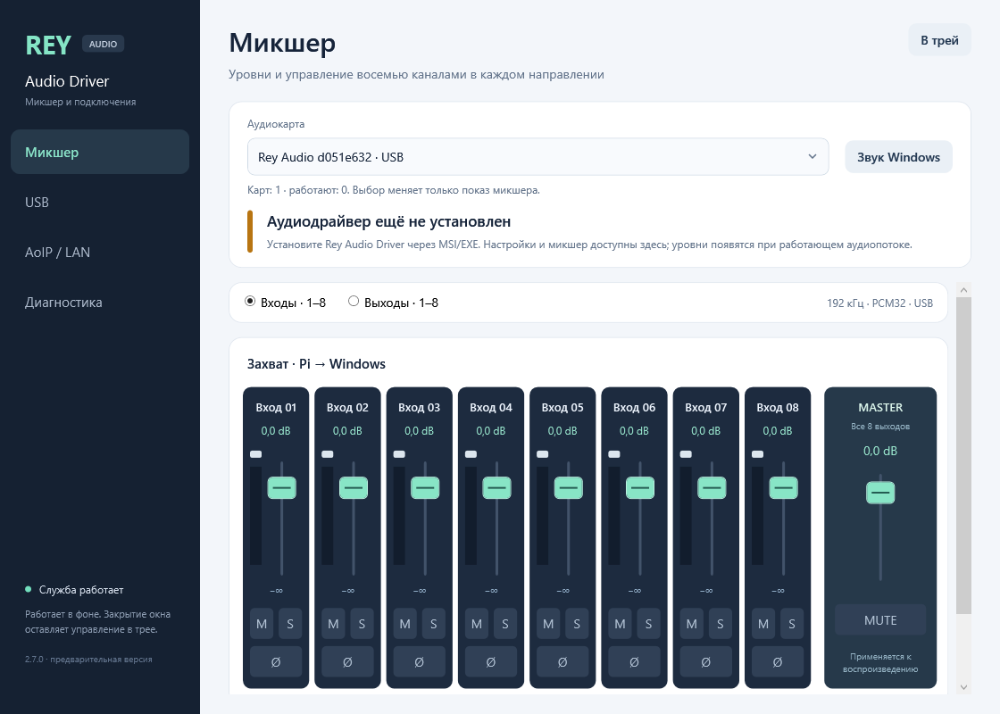

# Rey Audio Driver

**English** | [Русский](README.ru.md)

Windows 11 x64 audio driver, background service and mixer for Rey Audio on
Raspberry Pi 5. USB and AoIP / LAN have separate manual settings. Each card has
its own session and mixer; the selector at the top changes only the displayed
card. The catalog supports up to ten saved cards.

**2.7.0 preview:** [EXE / MSI](https://github.com/danrey-bilo/Rey-Audio-Driver-win/releases/tag/v2.7.0-preview.1) ·
[Install](docs/INSTALL.md) · [Windows channel pairs](docs/ENDPOINTS.md) ·
[Architecture and evidence](docs/REY-AUDIO-2.7.md).

| | USB | AoIP / LAN |
|---|---|---|
| Connection | Automatic discovery by permanent DeviceId | Add a Pi by its IPv4 address in the tray panel |
| Format | 8×8, PCM16/24/32, six rates 44.1–192 kHz | Negotiated from the Pi, up to 8 inputs and 8 outputs |
| Buffers | Manual transfer queue and audio period | Manual block, receive guard and packet frames |
| Transport | High-Speed interrupt, asynchronous WinUSB | UDP/IPv4, IOCP receive and bounded audio deadlines |
| Routing | Explicit USB choice for this card | Default once LAN is configured for this card |

The ACX code exposes stereo inputs/outputs **1/2, 3/4, 5/6, 7/8**, plus full
**1–8 multichannel** devices, for each 8×8 board. They are intended for ordinary
Windows audio applications and WASAPI/KS hosts. A matching USB/LAN DeviceId is
one card with a selectable transport. Separate cards have independent clocks;
they are not yet a synchronized aggregate interface.

Run **Rey-Audio-Setup-2.7.0-preview.1-x64.exe**, which contains the MSI.
The installer creates a unique local test certificate, signs SYS/CAT and deletes
the temporary private key. No paid certificate, signer or WDK is needed on the
client. **Windows Test Mode is required**. The EXE provides explicit preparation;
the user restarts Windows. MSI changes neither Secure Boot nor Core Isolation.
[Installation guide](docs/INSTALL.md) ·
[Options without Test Mode](docs/INSTALL-NORMAL-WINDOWS.md).

Mixer: gain, Mute, Solo, polarity, Master, real PCM meters and clipping counters.
Edits add no PCM queue and do not restart transport. Profiles and mixers are
stored per card in the registry; no INI or installation scripts are required.

Validation: **24 native contracts**, **12 finite real-Pi service checks**, a
30-second test selecting an offline card while the real USB stream continues,
and inspected MSI/EXE with verified local signing. **One physical Pi was used.**
Loaded ACX, actual Windows device enumeration, Chrome/Telegram, simultaneous
physical cards, elevated install/repair/uninstall and ADC/DAC remain unqualified.
This is a **Pre-release**.

USB physical roundtrip **below 2 ms** is the goal. Earlier 299s digital transport
RTT p50/p95/p99/max was **373/410/419/944.2 µs**; it excludes Windows audio engine
and converters. [USB results](https://github.com/danrey-bilo/Pi5-AUSB/blob/v0.1.0/docs/RESULTS.md).

Dependencies: [Pi5-AUSB](https://github.com/danrey-bilo/Pi5-AUSB) and
[AoIP-lib](https://github.com/danrey-bilo/AoIP-lib), with their existing visibility
and licenses. The service and panel build without an ASIO SDK. The immutable
[ASIO 2.5.0 release](https://github.com/danrey-bilo/Rey-Audio-Driver-win/releases/tag/v2.5.0)
remains available. Pi4 is unchanged.

[License](LICENSE) · [Mixer and latency](docs/MIXER.md) ·
[Release notes](docs/RELEASE-2.7.0.md)
