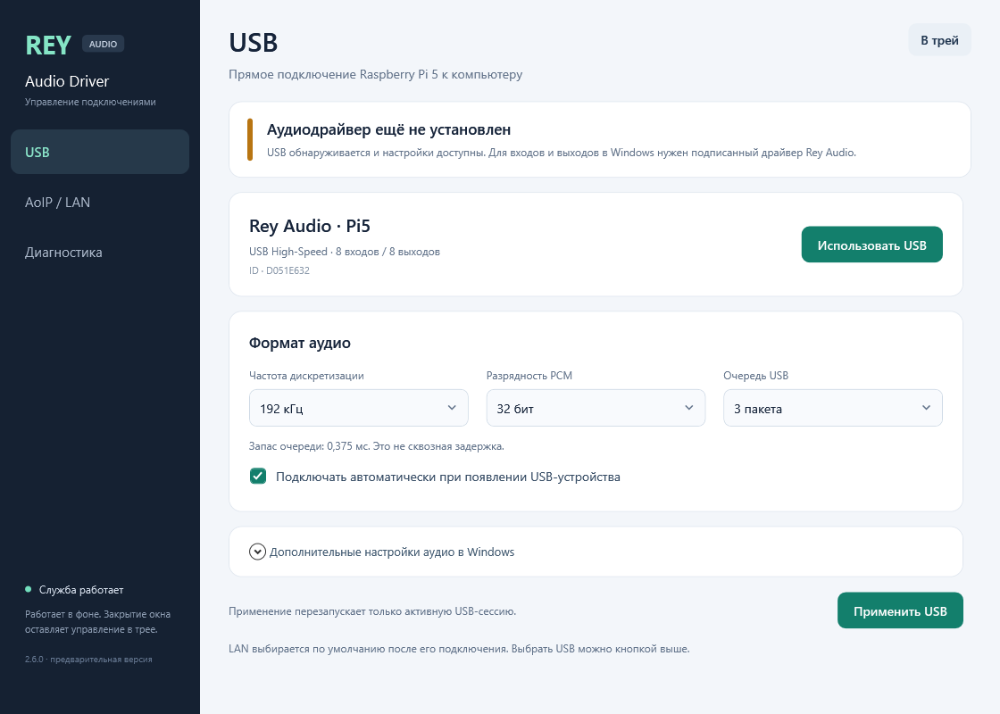

# Rey Audio Driver

[English](README.md) | **Русский**

Windows 11 x64: собственный ACX/KMDF аудиодрайвер и фоновая служба для Pi5.
Отдельные подключения **USB** и **AoIP / LAN**, независимые ручные настройки,
автоматическое обнаружение USB и новая панель с треем.

**2.6.0 preview:** [установка и устройство кода](docs/REY-AUDIO-2.6.ru.md) ·
[USB-транспорт](docs/USB-TRANSPORT.md) ·
[сборки](https://github.com/danrey-bilo/Rey-Audio-Driver-win/releases).

Служба и панель собираются без ASIO SDK. Собственный kernel-драйвер пока не
подписан, не установлен и не проверен через WASAPI. USB backend Pi выполняет
цифровой loopback. Панель явно показывает доступность аудиодрайвера; аппаратный
ADC/DAC и системные звуковые endpoints ещё требуют проверки.

| | USB | AoIP / LAN |
|---|---|---|
| Подключение | Автоматический поиск USB | Выбор и настройка Pi через трей |
| Формат | 8 входов + 8 выходов, PCM16/24/32, шесть частот 44,1–192 кГц | Формат от Pi, до 8 входов + 8 выходов |
| Буферы | Ручная очередь передачи и настройки аудиоустройства | Ручные block, guard и размер пакета |
| Передача | HS interrupt, WinUSB overlapped I/O | UDP/IPv4, IOCP RX и ограничение работы до deadline |
| Приоритет | Можно выбрать явно | По умолчанию после настройки LAN |

Распакуйте preview и запустите `tools/install_rey.ps1` из PowerShell
администратора. Скрипт проверяет EXE hashes, сохраняет настройки, создаёт
автоматическую службу **Rey Audio Driver** и автозапуск трея. Установка
kernel-драйвера — отдельный шаг на подготовленном стенде подписи.
[Инструкция](docs/REY-AUDIO-2.6.ru.md#установка-службы-и-панели).

USB-библиотека и Pi gadget находятся отдельно:
[Pi5-AUSB](https://github.com/danrey-bilo/Pi5-AUSB). Основная
[AoIP-библиотека](https://github.com/danrey-bilo/AoIP-lib) также остаётся
отдельной зависимостью. Видимость и лицензии библиотек сохранены.

Пройдены семь service contract checks и конечные тесты на реальном Pi:
независимость профилей, неверные команды, обнаружение занятого USB,
смена формата и переподключение. [Результаты и ограничения](docs/REY-AUDIO-2.6.ru.md#код-и-проверки).

Ранний 299-секундный 8x8/192000/32 USB-тест: цифровой RTT
p50/p95/p99/max **373/410/419/944,2 мкс**. Это цифровой транспортный loopback,
а не аналоговая задержка или задержка Windows audio engine.
[Полный USB-отчёт](https://github.com/danrey-bilo/Pi5-AUSB/blob/main/docs/RESULTS.ru.md).

Существующий ASIO адаптер и неизменённый [релиз 2.5.0](https://github.com/danrey-bilo/Rey-Audio-Driver-win/releases/tag/v2.5.0)
доступны на время перехода. [Прежнее описание](docs/RELEASE-2.5.0.ru.md).
Поддерживается один Pi; несколько плат, физический звук, аппаратный feedback и
прямой kernel USB путь пока не квалифицированы. Pi4 не изменён.

[Лицензия](LICENSE) · [Структура и сборка](docs/REY-AUDIO-2.6.md#build-and-structure)
