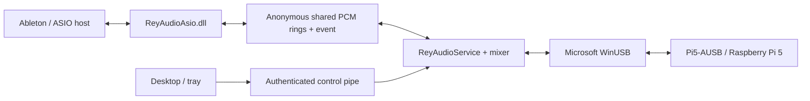

# USB architecture

Rey Audio Driver 2.8 supports one USB device. No AoIP library or network stack
is linked into the Windows audio service.

| Module | Responsibility |
|---|---|
| `src/engine` | USB identity, bounded transfer queues, packed PCM, frame timeline |
| `src/asio` | x64 ASIO COM frontend, one host, authenticated shared-memory IPC |
| `src/audio` | Allocation-free gain ramps, mute/solo/polarity, meters, PCM alignment |
| `src/service` | One session, USB detection/retry, control requests, atomic persistence |
| `src/platform` | MMCSS, timing, device naming, version resources |
| `src/bridge`, `drivers/Acx` | Optional Windows endpoint experiments; separate from ASIO package |
| `apps/ReyAudioControl` | WPF mixer, USB settings, diagnostics, tray |
| `installer/UsbAsioSetup` | Owned EXE installation/repair with payload hashes and rollback |

The service owns USB. Its transport callback exchanges PCM directly with the
mixer and bounded ASIO rings; it does not wait on the control pipe, perform
network operations, allocate buffers or run UI code. The host callback runs
on its own Pro Audio MMCSS thread. USB depth and ASIO render lead are distinct
manual controls. No queue is added by the channel faders.

In 2.8.1, IN is rearmed as soon as packet metadata and decoded PCM have moved
into local storage, before mixer/IPC and the OUT completion wait. No pointer
into that resubmitted slot is used afterward. Fresh USB profiles use depth4;
saved profiles retain their values. USB packets remain 125 µs apart, independent
of the ASIO block. Smaller ASIO blocks increase host callback frequency.

The installer verifies all payloads and replaces only files whose bytes differ
from the owned installation. A retained ASIO DLL blocks replacement if it changes;
identical DLLs do not need rewriting during a service/panel update.

Only the current USB interface is owned. A second attached interface cannot
replace a running card. If multiple interfaces exist with no current owner,
stream startup waits until exactly one remains. This policy is covered by
simulated enumeration tests; the bench contains one physical Pi.

Format 3 stores only USB and mixer, as `HKLM\Software\ReyAudio\UsbProfile`.
Formats 1/2 are accepted only for migration. The attached card's old profile
is imported once; old selections, network settings and catalogs are inactive.
ASIO BufferSize/RenderLeadBlocks remain per-user under
`HKCU\Software\ReyAudio\ASIO`; DeviceId binding is no longer read.

Changing USB format/pause restarts the owned stream; changing a fader does
not. After a USB removal or format change, reopen ASIO in the host. Physical
converter timing, sleep/resume, cable removal and generic Windows audio
endpoints remain separate qualification tasks.
