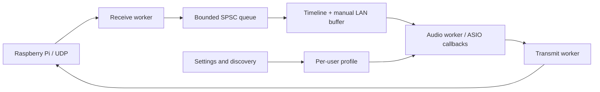

**English** | [Русский](ARCHITECTURE.ru.md)

# Windows driver architecture

The driver is an in-process x64 ASIO DLL. Audio threads use MMCSS and bounded work. The separate settings/tray executable loads the same panel from the DLL. Networking uses ordinary Windows UDP sockets; there is no custom NIC driver or kernel-bypass layer.

The receive worker validates packets and queues them. The audio worker owns the frame timeline, fills ASIO inputs and advances callbacks. The transmit worker sends ready output blocks with MTU fragmentation and bounded expiry/retry behavior. Windows scheduling and driver delays still affect the path.

ASIO block size and LAN receive guard are separate manual controls. Automatic tuning was removed. Device capabilities are discovered; no particular PC, NIC model or IPv4 address is built into the driver. Optional per-thread CPU overrides are advanced configuration, not default universal settings.

V3 adds masks, a leased session and exact digital-zero suppression. Physical channel counts remain device-owned. Legacy firmware uses V1/V2 behavior. One streaming ASIO client is supported. The driver does not provide Windows shared-mode endpoints or a hardware ADC/DAC backend.

See [host API](API.md), [buffer guide](BUFFER-GUIDE.md) and [validation](VALIDATION.md).
